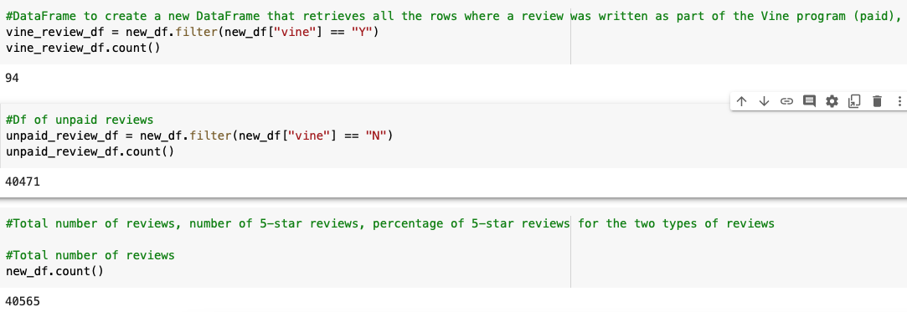

# Amazon_Vine_Analysis

### Overview of the analysis

The purpose of this analysis is to use PySpark to perform ETL to an Amazon's product dataset, connect to an AWS RDS instance and load into pgAdmin to analyze the reviews written by members of the paid Amazon Vine program. 

### Analysis Results

- From the Amazon Vine Analysis, the number of vine reviews and non-vine reviews are 94 and 40,471, respectively. 
- There are a total of 40,565 reviews where 15,711 have five stars. 
- Out of the 15,711 5-star reviews, 0.3 % are paid and 99.69% unpaid, which means 47 5-star paid reviews and 15,664 5-star non-paid reviews. 

*Fig.1 Reviews counts*

*Fig.2 Percentages of 5-star reviews*

### Analysis Summary

Based on the fact that 99.69% of the 5-star reviews come from non-paid customers, the reviews from the customers in the Vine program seem to be objective. Additionally to this analysis, a filter on the "verified_purchase" column would help remove possible outliers and have a more reliable conclusion on the product perception from the customer point of view. 
